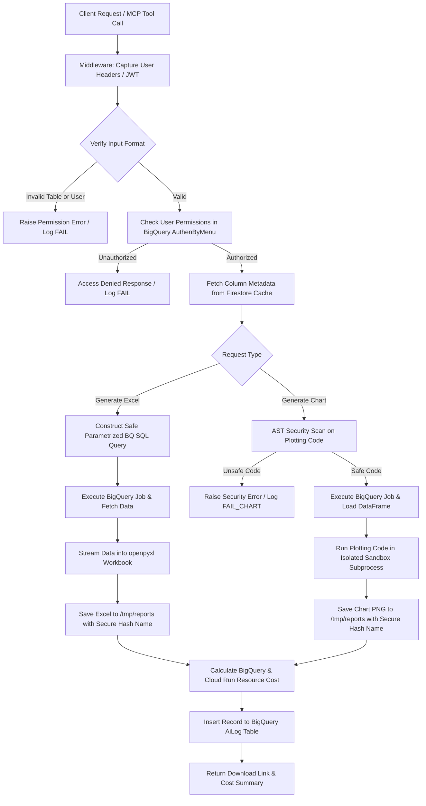

# SC Report Server & MCP API

An asynchronous REST API and **Model Context Protocol (MCP)** server built to authorize users, query BigQuery databases, dynamically translate columns using Firestore metadata, generate secure Excel reports, render visual charts via a secure sandbox, and log execution usage with detailed cost analysis.

---

## Technology Stack & Why We Used Them

| Technology | Role | Why It Was Chosen |
| :--- | :--- | :--- |
| **Python 3.10+** | Language | High readability, rich ecosystem for data handling, and robust cloud SDKs. |
| **FastAPI** | Web Framework | Extremely fast, built on ASGI standards (allowing asynchronous calls), automatic Swagger/Redoc UI documentation, and native support for Pydantic. |
| **FastMCP** | Model Context Protocol | Exposes functions as tools for Large Language Models (LLMs), allowing AI agents to interact with our BigQuery and report/chart generation pipelines directly. |
| **Google Cloud BigQuery** | Data Warehouse | Scalable, highly performant analysis of petabyte-scale datasets. Direct SDK integration enables quick querying and cost tracking. |
| **Google Cloud Firestore** | NoSQL Database | Used to store dynamic metadata (data dictionary / column translations) with a 5-minute TTL memory cache. Faster and more flexible than storing static files or schemas. |
| **openpyxl** | Excel Generation | Used in `write-only` mode (`Workbook(write_only=True)`) to append rows efficiently, ensuring very low memory footprints even with large datasets. |
| **Matplotlib & Seaborn** | Data Visualization | Generates publication-quality charts and graphs directly from BigQuery pandas DataFrames. |
| **AST (Abstract Syntax Tree)** | Security Sandbox | Parses and analyzes dynamic Python plotting code before execution, ensuring only safe libraries are imported and dangerous builtins/system APIs are blocked. |
| **Pydantic v2** | Data Validation | Enforces strict schemas and types for request payloads, reducing runtime errors and improving security. |
| **Uvicorn** | ASGI Web Server | A lightning-fast, production-ready ASGI server to power FastAPI. |

---

## How It Works (System Architecture & Flow)

The application coordinates authorization, schema translation, query execution, report/chart creation, and audit logging in a pipeline:



### 1. User Context & Middleware
- **Header Extraction:** A middleware interceptor (`capture_username_header`) grabs user credentials from headers (`current-user`, `current_user`, or `x-user-email`).
- **JWT Authorization:** The server supports extracting and verifying user emails from JWT tokens using a configured `LIBRECHAT_JWT_SECRET` via `extract_email_from_jwt`.
- **Context Var:** This information is stored in a thread-safe `ContextVar` (`CURRENT_REQUEST_USERNAME`) to avoid passing authentication details manually through functions.

### 2. Strict Input Validation & Security
- Usernames and BigQuery tables are validated using regular expressions (`USER_REGEX`, `BQ_TABLE_REGEX`) to block SQL injection attempts.
- Column requests are checked against allowed configurations.
- Direct access to sensitive tables (like `AuthenByMenu` or metadata catalogs) is strictly prohibited at the code level.

### 3. Permission Matching
- User roles and reports are mapped in the `AuthenByMenu` table in BigQuery.
- The system queries `AuthenByMenu` using safe parameters to ensure the user has rights to generate the requested dataset.

### 4. Dynamic Data Dictionary & Caching
- Column names in raw datasets are translated into user-friendly names dynamically.
- The mappings are fetched from Firestore under `data_dictionary/{DATASET_ID}/tables/{bq_table_name}`.
- To prevent Firestore billing spikes and reduce latency, mappings are cached in memory with a Time-To-Live (TTL) of **5 minutes**.

### 5. Secure Python Sandbox (for Charting)
When generating charts, users or agents provide a Python plotting script. To prevent remote code execution (RCE) and system compromise, the system validates and runs the code inside a strict sandbox (`graph_mcp.py`):
- **AST Safety Check:** Before execution, the code is parsed into an Abstract Syntax Tree (AST). It is scanned to ensure:
  - Only whitelisted libraries (`pandas`, `numpy`, `matplotlib`, `seaborn`, etc.) are imported.
  - Banned names and builtins (`open`, `eval`, `exec`, `__import__`, `os`, `sys`, `subprocess`, etc.) are blocked.
  - Dangerous property/magic attribute access (e.g., `__class__`, `__dict__`) is strictly forbidden.
- **Isolated Subprocess:** The verified script runs in an isolated subprocess with a 15-second timeout and clean environment variables (e.g., stripping database credentials and secrets).

### 6. Report Generation & Cost Estimation
- **Excel Stream:** Data is queried and written as a stream into an `.xlsx` workbook using `openpyxl` in write-only mode to conserve RAM.
- **Chart Plotting:** Data is loaded into a pandas DataFrame, plotted using the user's secure Python script, and rendered as a `.png` file.
- **Temporary Storage:** Files are saved under `/tmp/reports/` with a secure hashed filename layout containing the table name, a secure 8-character random hash, and a timestamp.
- **Cost Engine:** The system calculates:
    - **BigQuery cost** based on billed bytes ($6.25 per TB).
    - **Cloud Run cost** based on virtual CPU (vCPU), memory (GiB) allocations, and request duration.
    - Converts the total cost from USD to THB using configurable exchange rates.
- **Audit Logging:** Every query status (`OK`, `FAIL`, `FAIL_CHART`), generated size, row count, execution SQL query, and calculated costs are recorded in the `AiLog` BigQuery table.

---

## API Endpoints & MCP Tools

### REST HTTP Endpoints

- `POST /generate_excel_report`: Accepts details on columns, filters, and limit, validates permission, and generates the Excel file.
- `POST /generate_chart_report`: Accepts BigQuery table details, filters, and a Python plotting script (`code`), validates script safety via AST, runs the plotting script in the sandbox, and generates a `.png` chart.
- `POST /cost_estimate`: Mock-calculates pricing breakdowns for custom bytes and run durations.
- `GET /download/{file_name}`: Securely serves generated `.xlsx` sheets and `.png` charts (wrapped inside an auto-closing iframe to protect paths, unless `direct=true` is appended).
- `GET /files` or `GET /file`: Renders a premium, visual **File Manager UI** in dark mode with glassmorphism styling. Features include:
  - Live search bar to filter files dynamically.
  - Action buttons to View, Download, or Delete individual files.
  - Live thumbnail previews and interactive image viewing modals for generated charts.
  - **Clean up trigger:** A button to manually clear junk/expired files.
  - *Note: Returns JSON format if the request header doesn't accept HTML or if `format=json` is appended.*
- `DELETE /files/{file_name}`: Securely deletes a specific generated file.
- `POST /internal/cleanup`: Manually deletes expired reports. Securely authorized using a `X-Cleanup-Token` header.
- `GET /health`: Simple health-check endpoint.

### Model Context Protocol (MCP) Tools

- `check_accessible_reports`: Automatically inspects what reports the current user is authorized to access based on their header email/username. (No parameters required).
- `sc_report_export`: Tool for AI agents to query a table, check user access, and return an Excel file URL with metadata.
- `generate_excel_report`: Tool returning a formatted markdown summary with user-friendly logs and final Excel report download link.
- `generate_chart_report`: Tool allowing AI agents to generate visual charts/diagrams from BigQuery reports using custom Python plotting scripts (using Seaborn/Matplotlib) safely.

---

## Environment Variables Config

Set these variables in your deployment environment (e.g., Cloud Run or Docker):

| Variable | Description | Default / Example |
| :--- | :--- | :--- |
| `PROJECT_ID` | Google Cloud Project ID | `sc-ai-uat` |
| `DATASET_ID` | Target BigQuery Dataset | `SCReport` |
| `AUTH_TABLE` | Authorization table | `AuthenByMenu` |
| `LOG_TABLE` | Action logger table | `AiLog` |
| `PUBLIC_BASE_URL` | Public endpoint domain | `https://sc-report-866803019306.asia-southeast3.run.app` |
| `COST_USD_TO_THB` | USD to THB rate | `32.57` |
| `COST_BQ_PRICE_PER_TB` | BQ billing price per TB (USD) | `6.25` |
| `COST_CLOUD_RUN_VCPU` | Allocated vCPU | `1.0` |
| `COST_CLOUD_RUN_MEM_GIB` | Allocated Memory (GB) | `0.5` |
| `CLEANUP_STRATEGY` | Disk cleanup strategy (`age`, `keep_latest`, `aggressive`) | `age` |
| `CLEANUP_AGE_SECONDS` | Maximum file age before removal (seconds) | `86400` (24 Hours) |
| `CLEANUP_MAX_FILES` | Max files to keep if using `keep_latest` | `20` |
| `CLEANUP_SECRET` | Header secret token for manual cleanup trigger and file manager deletion | `super-secret-sc-cleanup-2025` |
| `LIBRECHAT_JWT_SECRET` | Secret key used to decode JWT and extract user emails | `""` |
| `SHOW_RAW_EMAIL` | Display raw emails in console logs instead of masking | `false` |

---

## 🤝 Technical Support & Troubleshooting

### Common Error Responses
1. **`❌ ไม่พบข้อมูลยืนยันตัวตนในระบบ` (No Auth Context)**
   - **Cause:** The request header (e.g., `x-user-email` or `current-user`) was not sent.
   - **Solution:** Ensure your client/front-end forwards user information in headers.
2. **`🙏 ขออภัย คุณไม่มีสิทธิ์เข้าถึงรายงานนี้` (Access Denied)**
   - **Cause:** The username has no authorization record mapping to that table in the `AuthenByMenu` BigQuery table.
   - **Solution:** Add the matching `UserName` and `ReportName` entry in BigQuery.
3. **`table_id '<name>' ไม่ถูกต้อง` (Invalid Table Format)**
   - **Cause:** Table ID has invalid characters or doesn't follow regex checks.
   - **Solution:** Ensure the table ID matches `[DatasetName].[TableName]` format.
4. **`ไม่พบข้อมูลในรายงาน` (Empty Report)**
   - **Cause:** BigQuery query returned 0 rows for the specified filters.
5. **`❌ โค้ดไวยากรณ์ไม่ถูกต้อง` / `Security Validation Error` (Chart Generation)**
   - **Cause:** The Python charting script contains syntax errors or violates the security AST policy (e.g., attempts to import unapproved modules like `os`, or accesses private attributes).
   - **Solution:** Restrict plotting scripts to standard Matplotlib/Seaborn functions and pandas DataFrame operations.

### Log Auditing
To inspect issues, query the BigQuery `AiLog` table:
```sql
SELECT CreatedAt, UserName, TableName, Status, CostSummary, URL 
FROM `sc-ai-uat.SCReport.AiLog`
ORDER BY CreatedAt DESC
LIMIT 50;
```
